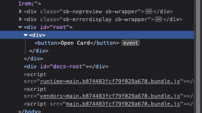
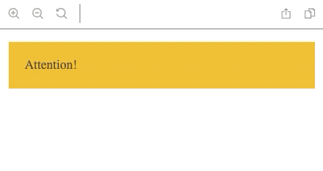

# `@frigobar/animation`

Easily add CSS animation to your react components via
[High-Order Components](https://reactjs.org/docs/higher-order-components.html).

> All the animations are created with
> [CSS Animations && @keyframes](https://developer.mozilla.org/en-US/docs/Web/CSS/animation)

## Installation

You can install `@frigobar/animation` using either of the methods below.

For npm users:

```shell
$ npm install @frigobar/animation --save
```

For Yarn users:

```shell
$ yarn add @frigobar/animation
```

An important note is that the **styled-components** is a peerDependency
[see why](https://styled-components.com/docs/faqs#i-am-a-library-author-should-i-bundle-styledcomponents-with-my-library), if
you dont have styled-components installed you'll
[need to install](https://styled-components.com/docs/basics#installation).

## Usage

You can simply import the desired animation from the package and use it in any
react component.

Example:

```javascript
import React from 'react';
import { withFade } from '@frigobar/animation';

const Button = props => <button {...props} />;

export default withFade(Button);
```

## Animations

Every animation will add new props to your component, it's necessary for you to
customize some behavior of it, like duration, when the animation starts,
what effect it will perform, etc.

Here is the list with all the current animations provided by this package.

- withFade - Fade (in / out) effect
- withFlash - Flash effect

### `withFade` - (fade in/out)

This animation perform a fade to the component, you can specify if it will be a
fade in, fade out or both.

It also controls if the component will be at the `DOM`.

The target component will be enhanced with some new props:

<!-- prettier-ignore -->
| **prop** | **description** | **type** | **default value** |
| ------------- | --------------- | ----------------- | ---- |
| renderControl | **Control** if the component is **rendered** in the DOM, if true, the component will be **added** to the DOM, if false, the component will be **removed** from the DOM  | `bool` | `true` |
| fadeDuration | the duration of the fade effect, it is a `ms` value | `number` | `300` |
| fadeIn | apply the `fade in` animation when the component is mounted (renderControl is true) | `bool` | `false` |
| fadeOut | apply the `fade out` animation when the component is unmounted (renderControl is false) | `bool` | `false` |
| onFadeEnd | Callback when the animation end | `func` | `() => {}` |

Example:

Lets suppose that you have a card component that will be visible only if you
click in a button, we can have a code like this:

```javascript
import React, { useState } from 'react';
import { Button, Card } from '@frigobar/core';

const ShowCard = () => {
  const [show, setShow] = useState(false);

  return (
    <div>
      <button onClick={() => setShow(!show)}>Open Card</button>

      {show && (
        <Card style={{ padding: 20 }}>A simple Card from frigobar/core</Card>
      )}
    </div>
  );
};
```

But in this example it do not have any kind of Fade animation.

We can add the animation like this:

```javascript
import React, { useState } from 'react';
import { withFade } from '@frigobar/animation';
import { Button, Card } from '@frigobar/core';

const FadedCard = withFade(Card);

const ShowCard = () => {
  const [show, toggleShow] = useState(false);

  return (
    <div>
      <button onClick={() => toggleShow(!show)}>Toggle Card</button>

      <FadedCard
        renderControl={show}
        fadeDuration={2000}
        fadeIn
        fadeOut
        style={{ padding: 20 }}
      >
        A simple Card from frigobar/core
      </FadedCard>
    </div>
  );
};

export default ShowCard;
```

Result:

`Element`


`DOM`



### `withFlash` - Flashing content

This animation perform a flashing to the component.

The target component will be enhanced with some new props:

<!-- prettier-ignore -->
| **prop** | **description** | **type** | **default value** |
| ------------- | --------------- | ----------------- | ---- |
| fadeDuration | the duration of every single flash, it is a `ms` value | `number` | `300` |
| flashStart | condition to start the flashing | `bool` | `true` |
| flashTimes | Specify how many times it will flash | `number` | `2` |
| flashInfinity | make the flashing never stop! | `bool` | `false` |
| onFlashEnd | Callback when the animation end (if `flashInfinity` prop is `true`, this will never be called.) | `func` | `() => {}` |

Example:

```javascript
import React from 'react';
import { withFlash } from '@frigobar/animation';

const Attention = props => (
  <div {...props} style={{ backgroundColor: 'orange', padding: 20 }}>
    Attention!
  </div>
);

const FlashingAttention = withFlash(Attention);

const App = () => <FlashingAttention flashInfinity />;

export default App;
```

Result:


